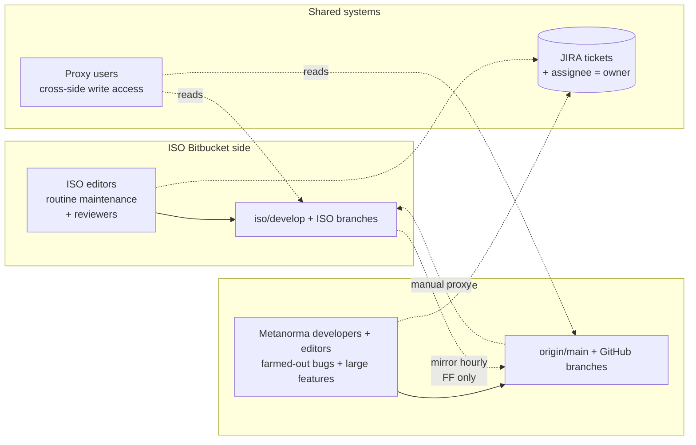
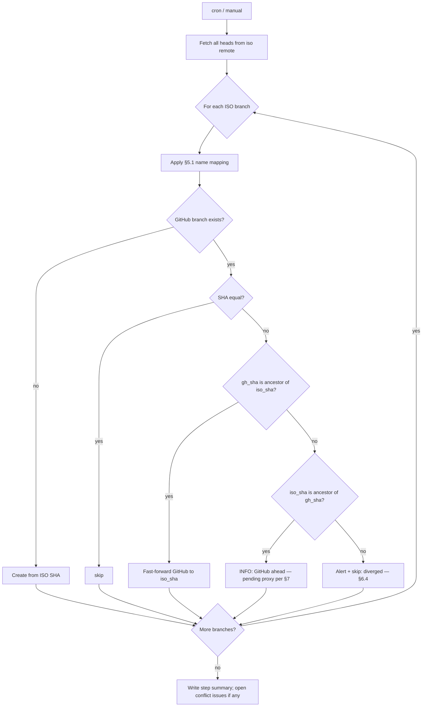
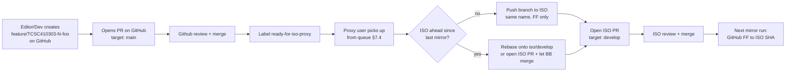

# ISO ↔ GitHub Mirror & Proxy Specification

**Status:** Draft for review (revision 3 — two-sided active editing)
**Related issue:** https://github.com/metanorma/iso-10303/issues/693
**Stakeholders:** @ronaldtse, @stuartgalt, @TRThurman

> **Implementation note (2026-07-02):** This spec describes the mirror algorithm and design. The implementation lives in [`metanorma/iso-10303-sync`](https://github.com/metanorma/iso-10303-sync) — a dedicated infrastructure repo, separate from the content repo `metanorma/iso-10303`. The workflow YAML in §6.7 reflects the cross-repo shape: it runs in `iso-10303-sync`, adds a `target` remote pointing at `iso-10303`, and pushes there. Nothing sync-related is committed to `iso-10303` itself.

---

## 1. Goals

1. **Both sides actively edit.** ISO editors maintain documents on Bitbucket as their daily work; Metanorma developers and editors work on GitHub. The two teams collaborate on the **same body of documents**, partitioned by JIRA ticket assignment.
2. **Task-based farm-out.** Routine document maintenance stays with ISO. Bug fixes and large feature requests are farmed out to Metanorma. Each farmed-out unit is one JIRA ticket with a single assignee at any time.
3. **One-way automatic mirror (ISO → GitHub).** A scheduled bot copies every ISO branch to GitHub so both teams see the same branch state without leaving their native tool. GitHub-original work is never silently overwritten.
4. **Manual proxy flow (GitHub → ISO).** When a GitHub PR is ready for ISO, a credentialed *proxy user* pushes the branch to Bitbucket and opens an ISO PR. This direction is **manual** — crossing the organizational boundary is intentional.
5. **Single repository.** All of this lives in `metanorma/iso-10303`. No second mirror repo.
6. **Default-branch reconciliation.** GitHub `main` is content-aligned with ISO `develop` once via §8; afterwards the two *oscillate* — `main` runs ahead as Metanorma PRs merge, reconverges after each proxy event.
7. **Conflict safety.** When a name collision cannot be resolved by fast-forward, the bot alerts and skips. **The bot never force-pushes** (hard rule).

## 2. Non-Goals

- Auto-proxy from GitHub to ISO (always manual — see §7).
- Auto-routing work between sides based on ownership (JIRA is the source of truth; humans move tickets).
- Auto-resolving concurrent-edit conflicts (humans rebase/merge).
- Mirroring tags.
- Mirroring ISO `main` (ISO's release branch) — see §5.1, Open Question §12.1.
- Auto-deleting GitHub branches when ISO prunes them (default off; configurable — see §6.5).
- Unifying GitHub CI and ISO CI (out of scope — see §12.13).

## 3. Background & Current State

### 3.1 Remotes (snapshot 2026-06-18)
| Remote | URL |
|---|---|
| `iso` | `https://sd.iso.org/bitbucket-pilot/scm/isotc184sc4/wg12-step.git` (ISO Bitbucket pilot) |
| `origin` | `git@github.com:metanorma/iso-10303.git` (GitHub) |

Both remotes use the standard `+refs/heads/*:refs/remotes/<name>/*` refspec locally.

### 3.2 Default branches
- ISO default: **`develop`** (integration branch — where ISO PRs land).
- GitHub default: **`main`** (collaboration branch — where GitHub PRs land).
- GitHub does **not** currently have a `develop` branch.

### 3.3 Branch inventory (snapshot)
- **ISO**: 54 branches — `develop`, `main`, plus JIRA-keyed branches:
  - `SC4UTILITI-<N>-<slug>` (7)
  - `TCSC410303-<N>-<slug>` (2 bare + many under `feature/` and `bugfix/`)
  - `SVRP-<N>-<slug>` (1)
  - `trial/*`, `trial-schema/*`
  - `test-remote-manifest` (transient)
- **GitHub**: ~40 branches — `mf-*`, `copilot/*`, `fix-*`, `feature/...` (non-ISO), `perform-*`, `rt-*`, numeric GitHub-issue refs (`208-*`, `588-*`, `697-*`, `676-*`, `13584-*`).

### 3.4 Default-branch divergence
- Merge-base of `main` and `iso/develop`: `68d4270d458b3d600d5e91d2a9d82dd33c6ca47c`
- **12 commits on `main` not on `iso/develop`** (GitHub-only work to preserve):
  - SVG map & clickability rework: `de818fa3b`, `ca4ec720f`, `0ca684530`, `609a89087`, `a8aa40726`, `2eed1d0e0`
  - Document identifier updates: `541b5b3e9`, `c0b60f79d`, `c69ce4a933`, `b1d89f5e4`, `7409a13f5`, `0cbcf478e`
  - Module `collection.yml` identifier fix (`TCSC410303-2825`)
- **180 commits on `iso/develop` not on `main`** (ISO-side work to absorb).
- Conclusion: GitHub's `main` is significantly **behind** ISO's `develop` and must be reconciled (§8) before ongoing sync can run cleanly.

### 3.5 Latent name collisions on GitHub
- Only `main` exists on both sides today.
- `feature/TCSC410303-2700-source-url-definition-in-iso-10303-2` and `feature/TCSC410303-2754-move-schema-mappings-from-documents-back-to-module-schemas` exist on GitHub, match the ISO branch pattern, but are **not** on ISO. Under the §5.3 guidance these are valid proxy-intended branches — but they've never been proxied. Recommended action: §11.

### 3.6 Workflow participants



- **ISO editors** work natively on Bitbucket. They handle routine document maintenance (typos, clarifications, small fixes) and review PRs from both sides on Bitbucket.
- **Metanorma developers and editors** work natively on GitHub. They handle farmed-out bug fixes and large feature requests, and review PRs from both sides on GitHub.
- **JIRA** (`TCSC410303`, `SC4UTILITI`, `SVRP` projects) is the canonical source of ticket ownership. Branch names embed the ticket ID; the assignee field tells you who currently owns the work.
- **Proxy users** bridge the two sides — they have write access on both, monitor the proxy queue (§7.4), resolve diverged branches (§7.11), and relay review feedback that doesn't otherwise cross.

## 4. Roles & Credentials

### 4.1 Roles

| Role | ISO access | GitHub access | Responsibilities |
|---|---|---|---|
| **ISO editor** | Read + write | None (or read-only) | Routine document maintenance on Bitbucket; reviews Bitbucket PRs |
| **Metanorma developer** | None | Read + write | Writes code on GitHub for farmed-out bugs and large features |
| **Metanorma editor** | None | Read + write | Writes content/docs on GitHub for farmed-out work |
| **Proxy user** (`@ronaldtse`, `@stuartgalt`, `@TRThurman`) | Read + write | Read + write | Pushes ready GitHub branches to ISO; opens ISO PRs (§7.5); resolves diverged branches (§7.11); relays review feedback; drives reconciliation (§8) |
| **Mirror bot** | Read-only PAT | PAT (write) | Hourly ISO → GitHub sync (§6); fast-forward only; never force-push |

### 4.2 Required GitHub secrets

| Secret | Purpose | Status |
|---|---|---|
| `ISO_BB_PAT` | Bitbucket pilot **read-only** PAT (used by mirror bot). The PAT encodes the owning account, so no separate username secret is required — the workflow uses `https://:${ISO_BB_PAT}@host`. | **Added 2026-07-02** |
| `ISO_BB_PAT_PROXY` | Bitbucket pilot **read+write** PAT (used by proxy users locally — never in CI) | Distribute to proxy users out-of-band |
| `METANORMA_CI_PAT_TOKEN` | GitHub PAT with `repo` scope on `metanorma/iso-10303`. Used by bot to push branches and to open conflict-tracking issues there. The dedicated name (rather than reusing `PRIVATE_TOKEN_GITHUB` from `build.yml`) keeps the mirror bot's blast radius separate from build CI. | To add to `metanorma/iso-10303-sync` |

> The mirror bot uses fast-forward only (§6.3), so a read-only ISO PAT is sufficient for it. Proxy users need write access on the ISO side — those credentials live with the humans, never in CI. ISO editors use their own Bitbucket accounts; they do not need GitHub access for routine work.

## 5. Branch Model

### 5.1 Name mapping

| ISO branch | GitHub branch | Rule |
|---|---|---|
| `develop` | `main` | Defaults are name-mapped; content oscillates around alignment (§1.6) |
| `main` | *(not mirrored)* | ISO release branch — out of scope (§12.1) |
| `<other>` | `<same name>` | 1:1 mirror |

### 5.2 ISO branch naming patterns (for documentation only — the mirror uses `git fetch iso` as the authoritative source)

```
develop                              # ISO integration branch
main                                 # ISO release branch (not mirrored)
SC4UTILITI-<N>-<slug>                # SC4 utilities JIRA ticket
TCSC410303-<N>-<slug>                # ISO 10303 JIRA ticket (bare)
feature/TCSC410303-<N>-<slug>        # feature branch under a JIRA ticket
bugfix/TCSC410303-<N>-<slug>         # bugfix branch under a JIRA ticket
SVRP-<N>-<slug>                      # SRL/SVRP epic
trial/<label>, trial-schema/<label>  # experiments
```

### 5.3 GitHub-side branch naming

Two valid categories (used by both sides when applicable):

**A. Proxy-intended branches** (the normal case for both ISO-farmed-out and Metanorma-originated ticket work).
- **Use the matching ISO naming pattern directly on GitHub** — e.g., `feature/TCSC410303-3001-new-module-foo`. This makes the eventual proxy push (§7) a 1:1 name match with no renaming step.
- The branch will eventually exist on both sides at the same SHA after the proxy round-trip.

**B. GitHub-local branches** (experiments, tooling, work not intended for ISO).
- Use prefixes that cannot be mistaken for ISO patterns:
  - `mf-*` (already in use)
  - `gh-*`
  - `copilot/*`
  - Numeric GitHub-issue refs: `<NNN>-*` (e.g., `588-*`, `697-*`)
- These are never proxied. The mirror ignores them entirely (it only walks `refs/remotes/iso/*`).

### 5.4 What about `main` protection?

If GitHub branch protection is enabled on `main` (likely, given the PR-driven flow), the mirror bot's hourly fast-forward push to `main` will be **rejected**. Three options — pick one in §11/§12:

- **(a)** Exempt the bot's PAT (`METANORMA_CI_PAT_TOKEN`) from `main` protection via "Allow specified actors to bypass". Recommended.
- **(b)** Have the bot open a fast-forward PR against `main` and auto-merge. Slower; preserves audit trail.
- **(c)** Disable protection on `main`. Not recommended.

### 5.5 Branch ownership and the JIRA contract

Because both sides edit using the same naming convention, the branch name alone cannot tell you who is currently responsible. **JIRA ticket assignment is the canonical source of ownership.**

| Rule | Detail |
|---|---|
| One branch per ticket | Branch name embeds the ticket ID (`TCSC410303-3001-...`). One ticket = one branch. |
| One assignee at a time | The JIRA "Assignee" field names the single current owner. |
| Owner commits | Only the current assignee (or their delegate) should push commits to the branch on their side. |
| Reassignment = handoff | When the ticket is reassigned, the new owner takes over the existing branch — they do **not** create a new one. |
| Routine maintenance | ISO editors keep this work; tickets may not exist for trivial changes — those land on `develop` directly via small ISO PRs. |
| Farmed-out triggers | When ISO creates a ticket and assigns it to a Metanorma lead, the work is "farmed out". Branch may already exist on ISO (skeleton) or be created fresh on GitHub by Metanorma. |
| Cross-side editing | If both sides must contribute to the same ticket (rare), coordinate via JIRA comments. One side pushes; the other pulls via the mirror before adding their work. |

## 6. Mirror Automation: ISO → GitHub (one-way)

### 6.1 Trigger
- **Schedule:** hourly (`0 * * * *` UTC).
- **Manual:** `workflow_dispatch` with optional `dry_run` input.

### 6.2 High-level flow



### 6.3 Update rules (per branch)

Let `iso_sha` = ISO branch tip. Let `gh_sha` = current GitHub branch tip (after applying the §5.1 mapping).

| Condition | Action |
|---|---|
| GitHub branch does not exist | **Create** from `iso_sha` |
| `gh_sha == iso_sha` | No-op |
| `gh_sha` is ancestor of `iso_sha` (GitHub behind) | **Fast-forward** to `iso_sha` |
| `iso_sha` is ancestor of `gh_sha` (GitHub strictly ahead) | **Info-log only** — this is the normal state between proxy events (§1.6). No alert. |
| Diverged (neither is ancestor) | **Alert**, skip (§6.4) |

**Hard rule:** the bot never uses `--force` or `--force-with-lease`. A rejected push is logged and the run continues.

### 6.4 Conflict alerts (diverged branches only)

With two sides actively editing the same branches, divergence is **expected during active work**. The alert is a monitoring signal — it surfaces the branch for human triage, not a run-failure-by-default.

When a branch is in the "diverged" state (both sides have unique commits), the bot:
1. Does **not** push that branch.
2. Continues processing other branches.
3. Opens or updates a GitHub issue titled `[iso-mirror] Conflict: <branch>` containing:
   - `iso_sha`, `gh_sha`, merge-base SHA, divergence counts both ways.
   - Commit subjects on each side (so the triager can see what's in flight without leaving GitHub).
   - Suggested resolutions:
     - If GitHub's unique commits are still pending proxy (§7) → do that first; once ISO merges, the mirror fast-forwards.
     - If both sides have unrelated in-flight work → coordinate via JIRA; one side pauses, the other proceeds, then they sync.
     - If GitHub's unique commits are stale → open a PR to reset GitHub to ISO (force-push by a human; never the bot).
4. The workflow run is marked **failed** so it is visible in the Actions UI.

Triage expectations:
- A proxy user reviews conflict issues at least weekly.
- Issues that remain open >14 days without activity are escalated (stale bot or human nudged via JIRA ticket).

### 6.5 Branch deletion (ISO side)

- **v1:** The bot does **not** attempt pruning detection. ISO branch deletion is the proxy user's responsibility — they track what they pushed and remove stale GitHub copies as needed.
- Reason: with both sides creating ISO-named branches directly on GitHub (§5.3), any pattern-based "this looks ISO but isn't on ISO" heuristic would generate false positives for every un-proxied editor branch.
- **v2 (optional):** Add stateful pruning detection using a cached snapshot of `refs/remotes/iso/*` from the previous run. Only branches that **were** on ISO last run and **aren't** this run are flagged. Out of scope for v1.

### 6.6 `main` ↔ `develop` — no special alert

- ISO `develop` maps to GitHub `main` per §5.1.
- Same update rules apply — no special alerting.
- After §8 reconciliation, GitHub `main` will normally be **ahead of** ISO `develop` (because Metanorma PRs merge into `main` continuously and proxy events are batched). This is the expected steady state, surfaced only as informational logging in the step summary.
- If you want a lag alert, configure `PROXY_LAG_THRESHOLD` (default: off). When set (e.g., `50`), the bot opens an issue if `main` is more than N commits ahead of `iso/develop`, suggesting the proxy queue is backing up.

### 6.7 Draft workflow file

Path (in `metanorma/iso-10303-sync`): `.github/workflows/iso-mirror-sync.yml`

The workflow lives in the **sync repo**. It uses `actions/checkout@v6` twice — once for the sync repo (to get the script), once for `metanorma/iso-10303` (the target, checked out at `./target` with `METANORMA_CI_PAT_TOKEN` for auth). The sync script runs from inside `target/`, where `origin` is naturally `iso-10303`. The `iso` BB remote is added manually (no `actions/checkout` equivalent for Bitbucket Server). Conflict-tracking issues are opened on `metanorma/iso-10303` via `GH_REPO` env.

```yaml
name: iso-mirror-sync
on:
  schedule:
    - cron: '0 * * * *'   # hourly
  workflow_dispatch:
    inputs:
      dry_run:
        description: 'Log what would happen, push nothing'
        required: false
        default: 'false'
        type: choice
        options: ['true', 'false']

permissions:
  contents: read

concurrency:
  group: iso-mirror-sync
  cancel-in-progress: false

jobs:
  sync:
    runs-on: ubuntu-latest
    steps:
      - name: Checkout sync repo (for the script)
        uses: actions/checkout@v6

      - name: Checkout target repo (metanorma/iso-10303)
        uses: actions/checkout@v6
        with:
          repository: metanorma/iso-10303
          token: ${{ secrets.METANORMA_CI_PAT_TOKEN }}
          path: target
          fetch-depth: 0

      - name: Configure git
        working-directory: target
        run: |
          git config user.name  "iso-mirror-bot"
          git config user.email "metanorma@ribose.com"

      - name: Add iso remote (sd.iso.org Bitbucket pilot)
        working-directory: target
        env:
          ISO_BB_PAT: ${{ secrets.ISO_BB_PAT }}
        run: |
          git remote add iso "https://:${ISO_BB_PAT}@sd.iso.org/bitbucket-pilot/scm/isotc184sc4/wg12-step.git"

      - name: Fetch iso
        working-directory: target
        run: git fetch iso '+refs/heads/*:refs/remotes/iso/*' --prune

      - name: Fetch origin (= iso-10303)
        working-directory: target
        run: git fetch origin '+refs/heads/*:refs/remotes/origin/*' --prune

      - name: Run sync
        working-directory: target
        env:
          GH_TOKEN: ${{ secrets.METANORMA_CI_PAT_TOKEN }}
          GH_REPO: metanorma/iso-10303
          DRY_RUN: ${{ inputs.dry_run || 'false' }}
          PROXY_LAG_THRESHOLD: ${{ vars.PROXY_LAG_THRESHOLD }}
        run: bash "$GITHUB_WORKSPACE/scripts/iso-mirror-sync.sh"
```

### 6.8 Draft sync script

Path: `scripts/iso-mirror-sync.sh` (executable)

```bash
#!/usr/bin/env bash
# One-way ISO → GitHub mirror. See docs/iso-mirror-sync.md for the full spec.
set -euo pipefail

DRY_RUN="${DRY_RUN:-false}"
PROXY_LAG_THRESHOLD="${PROXY_LAG_THRESHOLD:-}"   # empty = no lag alert
ORIGIN_REMOTE=origin
CONFLICT_BRANCHES=()
INFO_AHEAD=()
CREATED=()
FAST_FORWARDED=()

map_name() {
  case "$1" in
    develop) echo main ;;
    main)    echo "" ;;       # ISO release branch — out of scope (§5.1)
    *)       echo "$1" ;;
  esac
}

is_ancestor() {
  git merge-base --is-ancestor "$1" "$2" 2>/dev/null
}

while read -r iso_ref; do
  iso_branch="${iso_ref#refs/remotes/iso/}"
  [[ "$iso_branch" == "HEAD" ]] && continue

  iso_sha="$(git rev-parse "$iso_ref")"
  gh_branch="$(map_name "$iso_branch")"
  [[ -z "$gh_branch" ]] && continue

  gh_ref="refs/remotes/origin/$gh_branch"

  if ! git rev-parse --verify --quiet "$gh_ref" >/dev/null; then
    echo "[create] $gh_branch <- $iso_sha"
    CREATED+=("$gh_branch")
    if [[ "$DRY_RUN" != "true" ]]; then
      git push "$ORIGIN_REMOTE" "$iso_sha:refs/heads/$gh_branch"
    fi
    continue
  fi

  gh_sha="$(git rev-parse "$gh_ref")"
  if [[ "$gh_sha" == "$iso_sha" ]]; then
    echo "[equal]  $gh_branch"
    continue
  fi

  if is_ancestor "$gh_sha" "$iso_sha"; then
    echo "[ff]     $gh_branch $gh_sha -> $iso_sha"
    FAST_FORWARDED+=("$gh_branch")
    if [[ "$DRY_RUN" != "true" ]]; then
      git push "$ORIGIN_REMOTE" "$iso_sha:refs/heads/$gh_branch"
    fi
    continue
  fi

  if is_ancestor "$iso_sha" "$gh_sha"; then
    n="$(git rev-list --count "$iso_sha..$gh_sha")"
    echo "[info]   $gh_branch ahead of ISO by $n commit(s) — pending proxy (§7)"
    INFO_AHEAD+=("$gh_branch ($n ahead)")
    if [[ "$gh_branch" == "main" && -n "$PROXY_LAG_THRESHOLD" && "$n" -gt "$PROXY_LAG_THRESHOLD" ]]; then
      CONFLICT_BRANCHES+=("$gh_branch (main ahead of iso/develop by $n > $PROXY_LAG_THRESHOLD — proxy lag) iso=$iso_sha gh=$gh_sha")
    fi
    continue
  fi

  echo "[alert]  $gh_branch DIVERGED — iso=$iso_sha gh=$gh_sha"
  CONFLICT_BRANCHES+=("$gh_branch iso=$iso_sha gh=$gh_sha")
done < <(git for-each-ref --format='%(refname)' refs/remotes/iso/)

{
  echo "## ISO → GitHub mirror summary"
  echo
  if (( ${#CREATED[@]} )); then
    echo "### Created"
    printf -- '- %s\n' "${CREATED[@]}"
    echo
  fi
  if (( ${#FAST_FORWARDED[@]} )); then
    echo "### Fast-forwarded"
    printf -- '- %s\n' "${FAST_FORWARDED[@]}"
    echo
  fi
  if (( ${#INFO_AHEAD[@]} )); then
    echo "### GitHub ahead of ISO (informational — pending proxy per §7)"
    printf -- '- %s\n' "${INFO_AHEAD[@]}"
    echo
  fi
  if (( ${#CONFLICT_BRANCHES[@]} )); then
    echo "### Conflicts — manual resolution required (§6.4)"
    printf -- '- %s\n' "${CONFLICT_BRANCHES[@]}"
    echo
  fi
} >> "${GITHUB_STEP_SUMMARY:-/dev/stdout}"

if (( ${#CONFLICT_BRANCHES[@]} )); then
  echo "::error::${#CONFLICT_BRANCHES[@]} branch conflict(s) detected — see step summary"
  exit 1
fi
```

## 7. Proxy Workflow: GitHub → ISO (manual)

This is the path work takes from a GitHub PR merge to landing on ISO. It is **manual by design** — moving work across the organizational boundary is an intentional act by a credentialed user.

### 7.1 Conceptual model



### 7.2 Roles in the proxy flow

| Step | Who |
|---|---|
| Create branch on GitHub | Metanorma editor / developer |
| Open & merge PR on GitHub | Metanorma editor / developer + reviewers |
| Apply `ready-for-iso-proxy` label | Metanorma editor / developer (signals readiness) |
| Pull from proxy queue, push to ISO, open ISO PR | **Proxy user** |
| Review & merge on ISO | ISO reviewers (may include the same proxy user) |

### 7.3 Branch lifecycle on GitHub

1. Metanorma editor/developer creates a branch using the ISO naming convention directly (§5.3.A), e.g., `feature/TCSC410303-3001-new-module-foo`.
2. Opens a PR targeting `main`.
3. Reviewers review; editor addresses feedback via additional commits to the same branch.
4. PR merges into `main`. The feature branch typically stays (don't auto-delete — it'll be proxied).
5. Editor (or reviewer) adds the `ready-for-iso-proxy` label to the merged PR, or opens a tracking issue listing the branch.

### 7.4 Signaling readiness — the proxy queue

- Apply the GitHub label **`ready-for-iso-proxy`** to a merged PR when its content is ready to land on ISO.
- A small helper script lists branches ready for proxy:

Path: `scripts/iso-proxy-queue.sh` (executable, run locally by proxy users)

```bash
#!/usr/bin/env bash
# List GitHub branches that are ahead of their ISO counterparts and look proxy-ready.
# Run locally (not in CI). Requires both iso and origin remotes configured.
set -euo pipefail

git fetch --all --prune

echo "# Proxy queue — GitHub branches ahead of ISO"
echo

while read -r gh_ref; do
  gh_branch="${gh_ref#refs/remotes/origin/}"
  [[ "$gh_branch" == "HEAD" || "$gh_branch" == "main" ]] && continue

  case "$gh_branch" in
    SC4UTILITI-*|TCSC410303-*|SVRP-*|feature/TCSC410303-*|bugfix/TCSC410303-*|trial/*|trial-schema/*) ;;
    *) continue ;;
  esac

  gh_sha="$(git rev-parse "$gh_ref")"
  iso_ref="refs/remotes/iso/$gh_branch"

  if ! git rev-parse --verify --quiet "$iso_ref" >/dev/null; then
    n="$(git rev-list --count "iso/develop..$gh_sha" 2>/dev/null || echo "?")"
    echo "- $gh_branch — NEW on ISO (not yet pushed); $n commit(s) on top of iso/develop"
    continue
  fi

  iso_sha="$(git rev-parse "$iso_ref")"
  if [[ "$gh_sha" == "$iso_sha" ]]; then continue; fi

  if git merge-base --is-ancestor "$iso_sha" "$gh_sha" 2>/dev/null; then
    n="$(git rev-list --count "$iso_sha..$gh_sha")"
    echo "- $gh_branch — ISO behind by $n commit(s); FF push OK"
  else
    echo "- $gh_branch — DIVERGED from ISO; rebase needed before push (§7.11)"
  fi
done < <(git for-each-ref --format='%(refname)' refs/remotes/origin/)

echo
echo "# main ahead of develop"
main_ahead="$(git rev-list --count "iso/develop..origin/main" 2>/dev/null || echo 0)"
if [[ "$main_ahead" -gt 0 ]]; then
  echo "- main is ahead of iso/develop by $main_ahead commit(s) — consider proxying via §7.7"
fi
```

### 7.5 Standard proxy procedure (for a feature branch)

Run these locally as a proxy user (with both `iso` and `origin` remotes configured, using your **personal** ISO credentials — never CI secrets):

```bash
BRANCH=feature/TCSC410303-3001-new-module-foo

# 1. Make sure you have the latest from both sides.
git fetch --all --prune

# 2. Push the branch to ISO (creates if missing, fast-forwards if behind).
git push iso "origin/$BRANCH:$BRANCH"

# 3. Open a Bitbucket pull request targeting develop.
echo "Open ISO PR: https://sd.iso.org/bitbucket-pilot/projects/ISOTC184SC4/repos/wg12-step/pull-requests?create&sourceBranch=$BRANCH&targetBranch=develop"

# 4. After ISO merges, the next mirror run fast-forwards GitHub to match.
```

### 7.6 Handling ISO-ahead-during-proxy

If `iso/$BRANCH` (or `iso/develop` for direct-to-`main` proxies) advanced since the last mirror run, the proxy push will be **rejected as non-fast-forward**. Two resolution paths:

**Path A — Rebase first (preserves linear history):**
```bash
git checkout -B "$BRANCH" "origin/$BRANCH"
git fetch iso
git rebase "iso/$BRANCH"   # or iso/develop for main-targeted work
git push origin "$BRANCH:$BRANCH" --force-with-lease
git push iso "$BRANCH:$BRANCH"
```

**Path B — Let Bitbucket merge (preserves both histories):**
```bash
git push iso "$BRANCH:feature/TCSC410303-3001-new-module-foo-from-github"
# Open ISO PR; Bitbucket's merge commit reconciles both sides.
```

The proxy user picks the path per ISO team convention.

### 7.7 Direct-to-`develop` / `main` proxying

When a batch of GitHub PRs all merge into `main` and the team wants them on ISO `develop` in one shot:

```bash
git fetch --all --prune

# Option A — push main to develop directly (requires ISO to accept direct pushes):
git push iso "origin/main:develop"

# Option B — create a proxy branch on ISO and open a PR (recommended for audit):
git checkout -B feature/TCSC410303-XXXX-batch-from-github origin/main
git push iso feature/TCSC410303-XXXX-batch-from-github
# Open ISO PR targeting develop.
```

After ISO merges, the next mirror run sees `iso/develop` advanced to include the commits, and either fast-forwards `main` (if `main` is now an ancestor) or logs `main` as ahead (if more PRs merged in the meantime — those queue for the next batch).

### 7.8 PR batching strategy

| Strategy | When to use | Trade-off |
|---|---|---|
| **1:1** (one GitHub PR → one ISO PR) | Default | Full traceability; chatty on ISO side |
| **N:1** (batch GitHub PRs into one ISO PR) | Tight release windows; many small fixes | Loses per-PR audit on ISO; one merge commit per batch |
| **Merge-commits-as-batch** (let `main` accumulate, then proxy main→develop) | Routine integration of unrelated fixes | Simplest; ISO sees a single rolling stream |

Recommend documenting the chosen strategy per JIRA epic in the ISO PR description.

### 7.9 Receiving farmed-out work (ISO → Metanorma)

This is the most common cross-side flow.

**Sub-case A — Metanorma starts fresh on GitHub:**
1. ISO editor or product owner creates a JIRA ticket (e.g., `TCSC410303-3001-add-foo-module`) and assigns it to a Metanorma lead.
2. Metanorma lead accepts the assignment in JIRA, then either:
   - Begins work themselves, or
   - Re-assigns to a specific Metanorma editor/developer.
3. Metanorma editor creates `feature/TCSC410303-3001-add-foo-module` on GitHub (§5.3.A).
4. Standard GitHub PR flow (§7.3) → merge → label `ready-for-iso-proxy`.
5. Proxy user flushes the queue (§7.5) → ISO PR → ISO merge → mirror reconverges.

**Sub-case B — ISO created a skeleton branch first:**
1. ISO editor creates `feature/TCSC410303-3002-extend-bar` on Bitbucket with scaffolding commits, then assigns the JIRA ticket to Metanorma.
2. Mirror sees the new ISO branch and creates `origin/feature/TCSC410303-3002-extend-bar` on GitHub within the hour.
3. Metanorma editor checks out the mirrored branch, adds commits, opens PR targeting `main` (with the branch as the PR source).
4. PR merges. Branch is now ahead of ISO.
5. Proxy user pushes back to ISO (§7.5 step 2 — fast-forward since ISO branch is ancestor).
6. ISO PR → merge → mirror reconverges.

### 7.10 Reverse direction (Metanorma → ISO, rare)

When Metanorma spots an issue that's out of scope for the farmed-out work and ISO should handle it:

1. Metanorma files a JIRA ticket, assigns to ISO editor (or leaves unassigned with ISO as the component owner).
2. ISO editor picks up the ticket, creates the branch on Bitbucket, commits.
3. Mirror brings the branch to GitHub hourly.
4. Metanorma may review on GitHub (informational, since Metanorma doesn't merge on ISO).
5. ISO reviews and merges on Bitbucket.
6. Mirror fast-forwards GitHub.

### 7.11 Concurrent edits — diverged branches

When both sides have unique commits on the same branch (neither is an ancestor of the other), the mirror opens a `[iso-mirror] Conflict: <branch>` issue (§6.4). The proxy user triages:

| Situation | Resolution |
|---|---|
| Both sides actively working on unrelated parts of the branch | Coordinate via JIRA. One side pauses (or merges early via proxy); the other continues. Then the paused side rebases on the new common ancestor. |
| GitHub work is ready to merge; ISO work is in-flight draft | Push GitHub work to ISO via Path B (§7.6) — Bitbucket merges both histories. |
| ISO work is ready to merge; GitHub work is in-flight draft | Wait for ISO merge. Mirror fast-forwards GitHub. Then continue GitHub work on top. |
| GitHub commits are stale (abandoned) | Open a PR on GitHub to reset the branch to ISO SHA. Force-push by a human (never the bot). Close the conflict issue. |
| ISO commits are stale (abandoned) | Coordinate via JIRA to either merge them through anyway or have ISO revert/reset. |
| True merge conflicts on the same lines | Both editors meet (sync or JIRA thread) to agree on resolution. One side rebases, resolves conflicts, force-pushes (humans only). |

Resolution playbook for the proxy user:
1. Identify the JIRA ticket from the branch name.
2. Check JIRA assignee — that's the canonical owner.
3. If the owner has changed (reassignment), confirm with both old and new owners whose commits stay.
4. Pick a resolution path from the table above.
5. Execute the path (proxy push, or ask a human to rebase).
6. Verify the next mirror run reconciles cleanly (no new conflict issue).
7. Close the conflict issue with a comment recording what was done.

## 8. One-Time Reconciliation: `main` ↔ `develop`

### 8.1 Goal

Converge GitHub `main` and ISO `develop` once so subsequent mirror runs only see the expected "GitHub ahead via pending PRs" state — not the current 180-commits-behind mess.

### 8.2 Plan

1. **Create a reconciliation branch from `iso/develop`:**
   ```bash
   git fetch iso
   git checkout -b feature/TCSC410303-XXXX-github-main-reconcile iso/develop
   ```
   (Pick the next available `TCSC410303` ticket number; track via JIRA.)
2. **Cherry-pick the 12 GitHub-only commits in chronological order:**
   ```bash
   # merge-base = 68d4270d458b3d600d5e91d2a9d82dd33c6ca47c
   git cherry-pick 68d4270d..origin/main
   ```
   Resolve conflicts commit-by-commit. The 12 commits are isolated metanorma-side changes (SVG maps, doc identifiers, `collection.yml`), so conflicts should be localized.
3. **Proxy-push the reconciliation branch to ISO** (§7.5):
   ```bash
   git push iso feature/TCSC410303-XXXX-github-main-reconcile
   ```
4. **Open an ISO PR** targeting `develop`. Note in the description: *"This reconciles GitHub's `main` with ISO's `develop`. After merge, both branches share content and the mirror + proxy workflow keeps them aligned going forward."*
5. **Merge on ISO.**
6. **Mirror fast-forwards `main`.** Next hourly run sees `iso/develop` advanced past `origin/main` (which is now an ancestor) and fast-forwards `main` to `iso/develop`'s tip.
7. **Confirm convergence:**
   ```bash
   git fetch --all
   test "$(git rev-parse origin/main)" = "$(git rev-parse iso/develop)" \
     && echo "main and develop converged" \
     || echo "DIVERGED — investigate"
   ```

### 8.3 Rollback

If the ISO reconciliation PR is rejected, abandon the reconciliation branch on ISO. GitHub's `main` is unchanged throughout — only the new reconciliation branch was pushed.

## 9. Use Cases

### UC1 — ISO editor advances a branch (no Metanorma action needed)
1. ISO editor commits to `feature/TCSC410303-3001-routine-typo-fix` on Bitbucket.
2. ISO opens Bitbucket PR; ISO reviewers approve; merge into `develop`.
3. ISO branch is deleted post-merge (Bitbucket default).
4. Mirror run: GitHub's `feature/TCSC410303-3001-routine-typo-fix` is now ahead of ISO's (which no longer exists) — but per §6.5 v1, no alert; the GitHub copy lingers until manually cleaned up.
5. Mirror also fast-forwards `main` to `iso/develop`'s new tip (since `main` is now an ancestor).
6. Metanorma team sees the change in `main`; no action required.

### UC2 — Editor starts new work on GitHub (farmed-out from ISO)
1. ISO product owner creates JIRA ticket `TCSC410303-3002-add-qux-module`, assigns to Metanorma lead.
2. Metanorma editor creates `feature/TCSC410303-3002-add-qux-module` on GitHub (§5.3.A).
3. Opens a PR targeting `main`.
4. Reviewer approves; PR merges.
5. Editor adds the `ready-for-iso-proxy` label.
6. The branch appears in the proxy queue at the next `scripts/iso-proxy-queue.sh` run.

### UC3 — Proxy user flushes the queue
1. Proxy user runs `scripts/iso-proxy-queue.sh` locally.
2. Sees `feature/TCSC410303-3002-add-qux-module` listed as "NEW on ISO".
3. Follows §7.5: pushes branch to ISO, opens Bitbucket PR targeting `develop`.
4. ISO reviewers approve and merge.
5. Next mirror run sees `iso/feature/TCSC410303-3002-add-qux-module` at the merged SHA; `origin/feature/TCSC410303-3002-add-qux-module` is an ancestor → fast-forward.

### UC4 — Metanorma continues work on an ISO-created skeleton branch
1. ISO editor creates `feature/TCSC410303-3003-extend-bar` on Bitbucket with scaffolding commits, assigns JIRA ticket to Metanorma.
2. Mirror brings branch to GitHub (hourly).
3. Metanorma editor checks it out, opens PR `mf-3003-extend-bar` targeting `feature/TCSC410303-3003-extend-bar` (the mirrored branch, not `main`).
4. PR merges into the mirrored branch.
5. Mirror logs `[info] feature/TCSC410303-3003-extend-bar ahead of ISO by N commits`. **No alert.**
6. Proxy user pushes the branch back to ISO (§7.5 step 2 — FF since ISO branch is ancestor).
7. ISO PR → merge → mirror fast-forwards GitHub.

### UC5 — Concurrent edits cause divergence
1. ISO editor is mid-flight on `feature/TCSC410303-3004-shared-doc`, has pushed 3 commits to Bitbucket today.
2. Metanorma editor has been working on the same branch on GitHub, has pushed 2 commits today (didn't realize ISO was active on it).
3. Next mirror run: branch is diverged (3 ISO commits not on GitHub, 2 GitHub commits not on ISO).
4. Mirror opens `[iso-mirror] Conflict: feature/TCSC410303-3004-shared-doc` with commit subjects from both sides.
5. Proxy user triages (§7.11):
   - Checks JIRA: assignee is "Metanorma" but ISO editor has been working without reassigning.
   - Pings both editors via JIRA comment.
   - They agree: ISO finishes first (proxy-pushes GitHub's 2 commits via Path B from §7.6 — Bitbucket merge), then Metanorma rebases the next round on top.
6. After both rounds merge on ISO, mirror fast-forwards GitHub.

### UC6 — ISO advanced during the proxy window
1. Metanorma's branch `feature/TCSC410303-3005-baz` has been merged into GitHub `main` but not yet proxied.
2. Meanwhile, ISO `develop` advanced with unrelated commits from ISO editors.
3. Proxy user attempts §7.7 (push `main` → `develop`); push rejected as non-FF.
4. Proxy user picks Path A (rebase) or Path B (let Bitbucket merge) per §7.6.
5. After ISO merge, mirror reconciles `main` to `develop`'s tip.

### UC7 — Conflict detected, stale GitHub commits
1. Mirror run finds `feature/TCSC410303-3006-old` diverged: ISO has been actively merging through it; GitHub has commits from 30 days ago that were never proxied.
2. Bot opens `[iso-mirror] Conflict: feature/TCSC410303-3006-old`.
3. Proxy user investigates: JIRA ticket was reassigned from Metanorma back to ISO two weeks ago; GitHub commits are abandoned.
4. Proxy user opens a PR on GitHub to reset the branch to `iso/feature/TCSC410303-3006-old`'s SHA. Force-push by the human.
5. Next mirror run: branch is in sync (equal SHAs).
6. Proxy user closes the conflict issue.

### UC8 — ISO branch merged and deleted
1. ISO PR merged; Bitbucket auto-deletes `feature/TCSC410303-3007-completed`.
2. Mirror run sees the branch missing on ISO.
3. v1 behavior: **no automatic action or alert** (§6.5). The branch remains on GitHub.
4. Proxy user (who tracked the merge) deletes the GitHub branch when appropriate:
   ```bash
   git push origin :feature/TCSC410303-3007-completed
   ```
   Or keeps it for history (team's call).

### UC9 — Reverse direction (Metanorma → ISO)
1. Metanorma editor spots a typo in Part 41's bibliography. Out of scope for farmed-out work — files JIRA ticket `TCSC410303-3008-part41-bib`, assigns to ISO editor.
2. ISO editor accepts the ticket, creates `bugfix/TCSC410303-3008-part41-bib` on Bitbucket, commits the fix.
3. Mirror brings branch to GitHub.
4. Metanorma reviews on GitHub (informational; comment if anything looks wrong).
5. ISO PR → merge → mirror fast-forwards GitHub.

### UC10 — One-time reconciliation
See §8.

### UC11 — Credential expired (mirror side)
1. `git fetch iso` in the workflow fails with HTTP 401.
2. Workflow fails. Maintainer rotates `ISO_BB_PAT` in repo secrets.
3. Next scheduled run succeeds.

### UC12 — Credential expired (proxy side)
1. Proxy user's `git push iso` fails with 401.
2. Proxy user rotates their personal ISO PAT (out-of-band; not stored in CI).
3. Re-runs the proxy step.

### UC13 — ISO server unreachable
1. `git fetch iso` times out or fails connection.
2. Workflow fails for that run.
3. Next hourly run retries automatically. No data loss — the mirror is idempotent.

## 10. Failure Modes & Recovery

| Failure | Symptom | Recovery |
|---|---|---|
| ISO mirror PAT expired | `git fetch iso` returns 401 in CI | Rotate `ISO_BB_PAT`; rerun workflow |
| ISO proxy PAT expired | `git push iso` returns 401 locally | Proxy user rotates personal PAT; not a CI concern |
| ISO server unreachable | Network timeout / DNS failure | Wait for next hourly run; optionally `workflow_dispatch` for manual retry |
| Branch protection on `main` blocks bot FF push | Push rejected | Configure §5.4 option (a) — bypass for bot's PAT — or fall back to option (b) auto-merge PR |
| Proxy push rejected as non-FF (ISO advanced) | Push fails locally | Apply §7.6 (rebase or open ISO PR) |
| Diverged branch | Conflict issue opened | See §7.11; triage within 14 days |
| Both sides actively editing the same branch | Frequent divergence alerts | Coordinate via JIRA; one side pauses or proxies early (§7.11) |
| Cross-team review lag | Proxy queue grows beyond `PROXY_LAG_THRESHOLD` | Escalate in JIRA; consider proxy cadence §12.9 |
| JIRA ticket reassignment missed | Owner unclear; branch lingers | Audit JIRA ownership quarterly; close stale tickets |
| Workflow silently disabled | Stale data | Add status badge to README (§11); subscribe to Actions notifications |
| GitHub PAT lacks push permission | Push rejected in CI | Rotate `METANORMA_CI_PAT_TOKEN` with `repo` scope |
| Human force-pushes a mirrored branch | Subsequent run sees divergence | Treat as conflict (§6.4); resolve via §7.11 |
| Race: branch created on GitHub between fetch and push | Push rejected (already exists) | Logged and skipped; next run reconciles |
| Editor creates ISO-named branch but never labels it | Branch sits idle | Proxy user can run queue script anytime; also consider a stale-PR bot to remind |
| Editor accidentally pushes GitHub-local work to `mf-*` and proxies it | ISO branch with wrong name | Rename on ISO side (or close PR and re-push under correct name) |
| Change passes GitHub CI but fails ISO CI (or vice versa) | Late-stage rejection | Document CI differences in §12.13; align critical checks across sides |
| Editor commits to wrong side (e.g., ISO editor pushes to GitHub) | Branch created on wrong platform | Reverse the push; clarify in JIRA who owns the branch |

## 11. Setup Checklist

- [ ] Decide Open Questions §12 (especially §12.1 ISO `main`, §12.3 schedule, §12.4 existing-branch rename, §12.5 bot-vs-PR push strategy, §12.6 PR label name, §12.9 proxy cadence, §12.14 JIRA conventions).
- [ ] Open a JIRA ticket for the reconciliation work (e.g., `TCSC410303-XXXX`).
- [ ] For the two latent-collision branches (§3.5), decide: rename to keep as GitHub-local, OR keep as-is and track as proxy-pending.
- [ ] Generate a **read-only** Bitbucket pilot PAT for the bot; add as `ISO_BB_PAT` in repo secrets. (Done 2026-07-02. No separate username secret needed — PAT encodes the owning account.)
- [ ] Distribute **read+write** Bitbucket pilot PATs to proxy users out-of-band (`ISO_BB_PAT_PROXY` — never in CI).
- [ ] Add `METANORMA_CI_PAT_TOKEN` secret to `metanorma/iso-10303-sync` (GitHub PAT with `repo` scope on `metanorma/iso-10303`). Dedicated token, not reused from `build.yml`.
- [ ] Configure branch protection on `main` per §5.4 (recommend option a — bot PAT bypass).
- [ ] Create the `ready-for-iso-proxy` GitHub label.
- [ ] Document JIRA workflow conventions (who assigns, who reassigns, what ticket states mean) — share with both teams.
- [ ] Add `.github/workflows/iso-mirror-sync.yml` (§6.7).
- [ ] Add `scripts/iso-mirror-sync.sh` (§6.8), `chmod +x`.
- [ ] Add `scripts/iso-proxy-queue.sh` (§7.4), `chmod +x`. Documented for local use.
- [ ] Dry-run the mirror workflow (`workflow_dispatch` with `dry_run=true`) and review step summary.
- [ ] Execute §8 reconciliation plan.
- [ ] After reconciliation, confirm `main` ↔ `develop` converged.
- [ ] Add an `iso-mirror-sync` status badge to `README.md`.
- [ ] Add a short "Proxy workflow" + "Farm-out workflow" section to `README.md` or `CONTRIBUTING.md` pointing to this doc.
- [ ] Brief ISO editors on what the mirror does (so they understand the GitHub copies they may hear about).
- [ ] Brief Metanorma editors on JIRA ownership and farm-out conventions.
- [ ] Close issue #693 with a link to this doc.

## 12. Open Questions

1. **ISO `main` mirroring.** ISO has a `main` (release) branch distinct from `develop`. Should it be mirrored to GitHub under a non-default name (e.g., `iso-main` or `iso/main`) for visibility? Currently out-of-scope (§5.1).
2. **Deletion policy (v2).** Default in v1 is "no pruning detection" (§6.5). For v2, do we want stateful pruning detection? If yes, what action on detected pruning — alert, or auto-delete?
3. **Schedule frequency.** Hourly is proposed. During active cross-team collaboration on the same branch, hourly may be too coarse — consider 15-minute cadence then, or trigger mirror on demand.
4. **Existing GitHub branches matching ISO patterns** (§3.5). Confirm: rename to `mf-*`, or keep and treat as proxy-pending?
5. **Conflict issue assignment.** Should conflict issues be auto-assigned to a specific maintainer or a team? Currently unassigned.
6. **`main` push strategy** (§5.4). Confirm option (a) bot-PAT-bypass-protection vs. (b) bot-opens-FF-PR.
7. **PR label name.** `ready-for-iso-proxy` is proposed. Confirm or pick another.
8. **PR batching default** (§7.8). Confirm 1:1 vs. N:1 vs. main-rolling.
9. **Proxy cadence.** On-demand (proxy user runs when queue looks long) vs. scheduled (e.g., daily sweep by a designated proxy user).
10. **ISO PR workflow for round-trip.** Does ISO's Bitbucket process require approval from someone outside the metanorma team? If yes, add lead time to §7 estimates.
11. **`METANORMA_CI_PAT_TOKEN` scope.** (Resolved 2026-07-02: dedicated token under this name, kept separate from `PRIVATE_TOKEN_GITHUB` used by `build.yml`, so the mirror bot's blast radius is independent of build CI.) Open follow-up: should this be a GitHub App instead of a user PAT, for finer-grained permissions and easier rotation?
12. **Editor onboarding.** How do new editors (both sides) learn the workflow? Add a CONTRIBUTING.md section? ISO-side equivalent document?
13. **CI alignment.** Document the differences between GitHub Actions CI and ISO CI. Decide whether critical checks (EXPRESS validation, schema manifest, build) must pass on both sides before merge.
14. **JIRA ownership hygiene.** Define the rules for ticket ownership transitions. How often do we audit for stale assignments? Who owns stale-ticket cleanup?
15. **"Done" definition for farmed-out work.** When is a Metanorma ticket considered "done"? When the GitHub PR merges? When the proxy completes? When ISO merges? When published? This affects accountability and review SLAs.
16. **Cross-side review visibility.** Can ISO reviewers see GitHub PRs (via mirror copies or shared accounts)? Can Metanorma reviewers see Bitbucket PRs? If not, the proxy user must relay review feedback explicitly — needs a documented protocol.

## 13. Test Plan

| Case | Expected behavior |
|---|---|
| New ISO branch (ISO editor created) | Bot creates GitHub branch; step summary lists under "Created" |
| ISO branch with new commit from ISO editor, GitHub untouched | Bot fast-forwards; step summary lists under "Fast-forwarded" |
| GitHub branch with merged PRs not yet proxied | Bot logs INFO under "GitHub ahead of ISO"; no alert (this is the normal steady state) |
| `main` ahead of `develop` by < threshold | INFO only, no alert |
| `main` ahead of `develop` by > `PROXY_LAG_THRESHOLD` (if set) | Alert in step summary; no issue opened automatically in v1 |
| Diverged branch (both sides edited) | Bot opens conflict issue; run fails; branch untouched; proxy user triages per §7.11 |
| ISO branch deleted (post-merge) | No action, no alert (v1 §6.5); branch remains on GitHub |
| ISO PAT invalid | Workflow fails with 401 in `Fetch iso` step |
| `dry_run=true` | All decisions logged; no pushes; step summary shows what would happen |
| Editor creates ISO-named branch, hasn't proxied yet | No alert; branch simply not in ISO remote; queue script (§7.4) lists it as "NEW on ISO" |
| Editor labels merged PR `ready-for-iso-proxy` | No automated action; label is for human proxy user's queue review |
| Proxy user pushes branch that has rebased commits ahead of ISO | ISO push succeeds (FF); mirror next run aligns both sides |
| **Concurrent edit** — ISO editor and Metanorma editor both push to same branch in same hour | Next mirror run opens `[iso-mirror] Conflict: <branch>`; proxy user triages via §7.11 |
| **Farm-out sub-case A** — ISO creates ticket, Metanorma starts fresh on GitHub | Branch appears in proxy queue after GitHub PR merge; ISO receives branch via §7.5 |
| **Farm-out sub-case B** — ISO creates skeleton branch on Bitbucket | Mirror creates GitHub copy within the hour; Metanorma builds on it via PR targeting the branch |
| **Reverse farm-out** — Metanorma files ticket, ISO handles | ISO commits on Bitbucket; mirror brings to GitHub; Metanorma reviews informationally |
| **JIRA reassignment mid-flight** — Ticket moves from Metanorma to ISO | Old GitHub branch may linger; new ISO commits appear on the mirrored branch via FF; proxy user cleans up stale GitHub copy if needed |

> **Pre-flight warning:** the very first non-dry run **after §8 reconciliation** will fast-forward GitHub's `main` from its current tip to `iso/develop`'s tip. This is desired and safe *because* reconciliation (§8) is what makes the 12 GitHub-only commits land on ISO first. **Do not run the mirror non-dry before §8 completes** — otherwise `main` would lose those 12 commits from its reachable history (they remain in reflog and on any `mf-*` branches that may contain them, but no longer on `main`).
